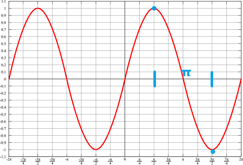
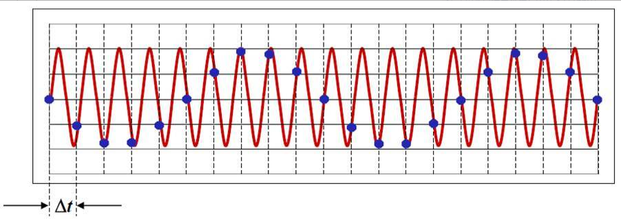

> 当初我对爱情的想象，如今全都走了样。 --- 《走样》

写这篇文章，我是认真的，专门听了《走样》这首歌，寻找一下写作的感觉。俗话说，做人和唱歌一样，歌一定要唱完，人不可以做一半。所以，文章也不能只写开头。

现实生活中，走样无处不在，歌词中描述了爱情在时间域下的走样，而上图则反映了空间域上走样。当我们了解的信息（采样）不足以正确还原真相时，就会产生走样。

傅里叶告诉我们，任何函数都可以通过正余弦函数，我们通过一个简单的$\sin(x)$描述采样的过程，以及在这个过程中如何产生了走样。

如上图所示，对于一个正弦函数，至少需要两个采样点（蓝色），这两个采样点告诉了该函数的极值（Amplitude，振幅）以及周期长度（Period），然后我们才能重建该正弦函数。已知正弦函数的周期$T_{sin} = 2\pi$，则采样点周期（间隔）$T_s \leqslant \pi = 2T_{sin}$。已知频率$f$和周期$T$互为倒数：$f = \frac{1}{T}$，我们可得如下推论（$f_{max}$为函数最大频率）：

$T_s \leqslant 2T_{max} \Rightarrow$ $f_s \geqslant 2f_{max}$。

该条件称为奈奎斯特-香农（Nyquist-Shannon）采样定理，该定理告诉我们，当我们对一个函数进行采样时，为了保证采样点能够真实还原该函数，**采样频率大于被采样信号最高频率的两倍**。

图形渲染中，走样也是不可避免的。
